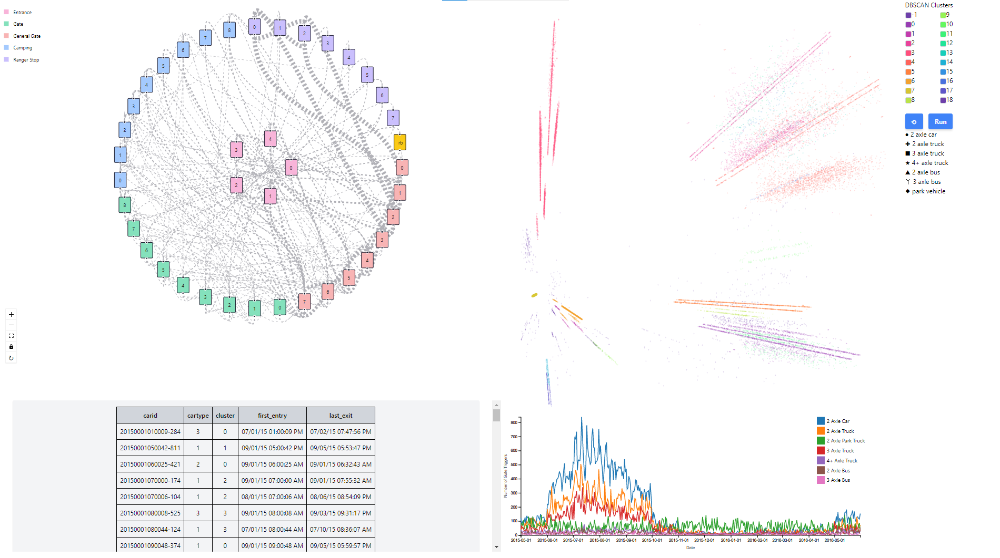

# VASTly-Hyperbolical
Contributors: [Joe Hilleary](https://github.com/jchill-git), [Nirmiti Naik](https://github.com/nirmitin), and [Gabriel Sessions](https://github.com/gabrielsessions) \
Tufts CS 178: Visual Analytics Final Project

## About Our Project
The goal was to develop a visual analytics solution to solve the 2017 VAST Challenge: Mini-Challenge 1.

## Architecture
- Frontend: React, 
- Backend: Node.js, PostgreSQL

## How to setup the project
0. Download/Install Node.js
1. Clone the repository
2. Set up the database
> - Download and install PostgreSQL
> - Upload the data found in the website/api/data folder
> - Lekagul_Sensor_Data.csv should go into a table called `sensor_data`
> - tsne_table.csv should go into a table called `car_data`
3. After completely setting up the database, cd into the frontend folder in a terminal and run `npm install`.
4. Run `npm run dev` to boot up the frontend development server.
5. Open up another terminal, cd to the api (backend) folder and run `npm install`
6. Run `npm start`
7. Open up the link generated on the frontend server

If you've already completed the initial setup (steps 1-3), run steps 4-7 to boot up the project.

